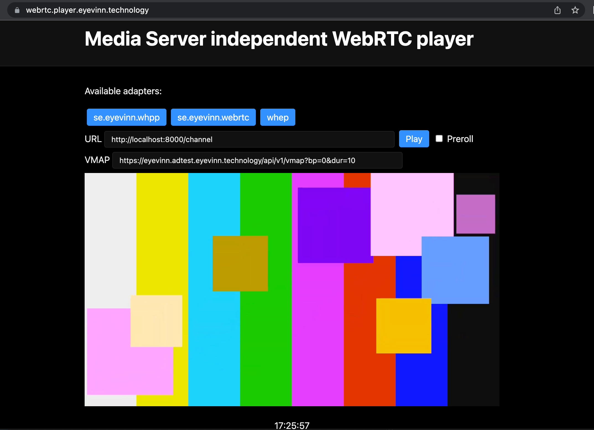

# SRT to WHEP
This application ingests one MPEG-TS over SRT stream and outputs to WebRTC recvonly clients using WHEP as signaling protocol.

Supports SRT streams in caller and listener mode.



### Pre-req OSX
Requirements:
- XCode command line tools installed
- Install GStreamer [binaries](https://gstreamer.freedesktop.org/data/pkg/osx/) from GStreamer's website
- Install Rust using rustup

## Build and Install Dependencies

Build with Cargo

```
cargo update
cargo build --release
```

The binary is then available at `./target/release/srt-whep`

## Usage

To ingest an SRT stream with address `srt://127.0.0.1:1234` in listener mode and expose WHEP endpoint on port 8000 run the application with this command.

```
cargo run -- -i 127.0.0.1:1234 -o 127.0.0.1:8888 -p 8000 -s caller
```

This will also make a pass-through of the SRT stream on `srt://127.0.0.1:8888` in listener mode. To watch the pass-through stream in ffplay or VLC you run:

```
ffplay srt://127.0.0.1:8888
```

WHEP endpoint is available then at `http://localhost:8000/channel`. You can then play it for example using the WHEP [Player](https://webrtc.player.eyevinn.technology/?type=whep). 

If the SRT stream to ingest is in caller mode you run the application with this command.

```
cargo run -- -i 127.0.0.1:1234 -o 127.0.0.1:8888 -p 8000 -s listener
```

This also expects the SRT address `127.0.0.1:8888` to be running in listener mode.

## License (Apache-2.0)

Copyright 2023 Eyevinn Technology AB

Licensed under the Apache License, Version 2.0 (the "License");
you may not use this file except in compliance with the License.
You may obtain a copy of the License at

    http://www.apache.org/licenses/LICENSE-2.0

Unless required by applicable law or agreed to in writing, software
distributed under the License is distributed on an "AS IS" BASIS,
WITHOUT WARRANTIES OR CONDITIONS OF ANY KIND, either express or implied.
See the License for the specific language governing permissions and
limitations under the License.

## Issues
All relevant discussions are tracked in the [issues](https://github.com/Eyevinn/srt-whep/issues/)

## Support

Join our [community on Slack](http://slack.streamingtech.se) where you can post any questions regarding any of our open source projects. Eyevinn's consulting business can also offer you:

- Further development of this component
- Customization and integration of this component into your platform
- Support and maintenance agreement

Contact [sales@eyevinn.se](mailto:sales@eyevinn.se) if you are interested.

## About Eyevinn Technology

Eyevinn Technology is an independent consultant firm specialized in video and streaming. Independent in a way that we are not commercially tied to any platform or technology vendor.

At Eyevinn, every software developer consultant has a dedicated budget reserved for open source development and contribution to the open source community. This give us room for innovation, team building and personal competence development. And also gives us as a company a way to contribute back to the open source community.

Want to know more about Eyevinn and how it is to work here. Contact us at work@eyevinn.se!