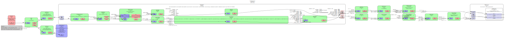

# SRT to WebRTC
This application ingests one MPEG-TS over SRT stream and outputs to WebRTC recvonly clients using WHEP as signaling protocol.

## Build
### OSX
Requirements:
- XCode command line tools installed
- Install GStreamer using Homebrew or from GStreamer's website
- Install Rust using rustup

If you want nicely formatted output you need to install bunyan

`cargo install bunyan`

Verify your installation with

`bunyan --help`


Gstreamer install via brew
```

brew install gstreamer gst-plugins-bad gst-plugins-good gst-plugins-ugly gst-libav
```

## Run

To generate SRT stream, you need to set the `GST_PLUGIN_PATH`, `GIO_EXTRA_MODULES` and `DYLD_LIBRARY_PATH` environment variable to where you have the gstreamer plugins installed, e.g:

```
export PATH=/Library/Frameworks/GStreamer.framework/Versions/Current/bin:$PATH
export GST_PLUGIN_PATH=/Library/Frameworks/GStreamer.framework/Versions/Current/lib:$GST_PLUGIN_PATH
export GIO_EXTRA_MODULES=/Library/Frameworks/GStreamer.framework/Libraries/gio/modules/ 
export DYLD_LIBRARY_PATH=$DYLD_LIBRARY_PATH:$GST_PLUGIN_PATH
```

Example command for starting a srt stream with screen captured video and a constant tone as audio.
```
gst-launch-1.0 -v \
    avfvideosrc capture-screen=true ! video/x-raw,framerate=20/1 ! timeoverlay ! videoscale ! videoconvert ! x264enc tune=zerolatency ! video/x-h264, profile=main ! mux. \
    audiotestsrc ! audio/x-raw, format=S16LE, channels=2, rate=44100 ! audioconvert ! voaacenc ! aacparse ! mux. \
    mpegtsmux name=mux ! queue ! srtsink uri="srt://127.0.0.1:1234?mode=caller" wait-for-connection=false
```
We are setting the srt sink as 'caller' mode, so our application needs to be in 'listener' mode. If srt sink is in 'listener' mode, the application needs to be in 'caller' mode.

Then run the application. 
```
cargo run -- -i 127.0.0.1:1234 -o 127.0.0.1:8888 -p 8000 -s listener
```
With pretty print
```
cargo run -- -i 127.0.0.1:1234 -o :8888 -p 8000 -s listener | bunyan
```

The whep server will be started on port 8000. You can then play it out using WHEP [Player](https://webrtc.player.eyevinn.technology/?type=whep). 

The pass-through SRT stream can be viewed using the following command:
```
gst-launch-1.0 -v playbin uri="srt://127.0.0.1:8888?mode=listener"
```

## Example


## Plans
- [x] Understand WHEP endpoint for WebRTC based streaming.
- [x] Check available tools for SRT to WebRTC
- [x] Build a prototype server for WHEP
- [x] Build the HTTP server in Rust
- [x] Add support for audio
- [x] Check the format/codec of the SRT stream
- [x] Write the pipeline in Rust
- [x] Add optional pass-through to another SRT receiver
- [x] Test with browser
- [x] Add support for graceful shutdown
- [x] Add support for multiple WebRTC clients
- [x] Add support for different SRT stream modes (caller/listener)
- [ ] Add support for different browsers
- [ ] Improve the error handling & logging
- [ ] Add support for cloud deployment

## Sample Pipeline


## Issues
All relevant discussions are tracked in the [issues](https://github.com/Eyevinn/srt-whep/issues/)

## Support

Join our [community on Slack](http://slack.streamingtech.se) where you can post any questions regarding any of our open source projects. Eyevinn's consulting business can also offer you:

- Further development of this component
- Customization and integration of this component into your platform
- Support and maintenance agreement

Contact [sales@eyevinn.se](mailto:sales@eyevinn.se) if you are interested.

## About Eyevinn Technology

Eyevinn Technology is an independent consultant firm specialized in video and streaming. Independent in a way that we are not commercially tied to any platform or technology vendor.

At Eyevinn, every software developer consultant has a dedicated budget reserved for open source development and contribution to the open source community. This give us room for innovation, team building and personal competence development. And also gives us as a company a way to contribute back to the open source community.

Want to know more about Eyevinn and how it is to work here. Contact us at work@eyevinn.se!