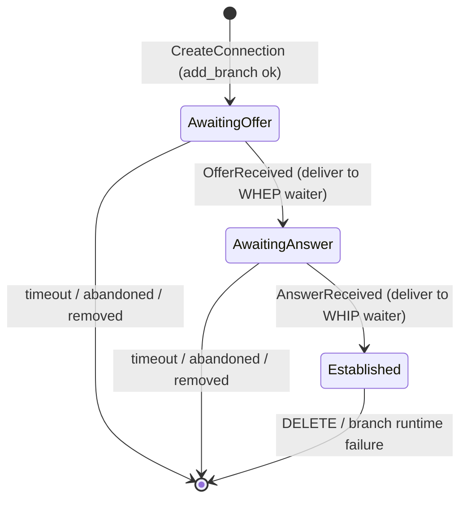

# From Shared Lock to Coordinator Actor

*A handover note on the v2.0.0 signaling-plane rewrite — what changed, why,
and how to reuse the pattern.*

**Who this is for:** whoever maintains srt-whep next, and anyone who wants to
learn the "single owner + messages + explicit state machine" paradigm from a
real before/after. It complements [`CONTEXT.md`](../CONTEXT.md) (the current
map) and [ADR 0001](adr/0001-signaling-plane-rebuild.md) (the decision record).
This doc is the *why it's better and how to apply it elsewhere* companion.

---

## TL;DR — the shift in one sentence

We moved from **shared mutable state guarded by locks, mutated from many
handlers, with the connection's lifecycle implied by a scatter of fields** to
**one task that owns all the state, is spoken to only by messages, and encodes
the lifecycle as an explicit state machine.**

That's the whole thing. Everything below is the detail behind that sentence.

---

## 1. The old design: shared-state rendezvous behind locks

Two HTTP handlers met in the middle through a shared map. A WHEP viewer POSTed
`/channel`; its handler created an entry and then **blocked** waiting for the
pipeline's `whipclientsink` to POST its SDP offer to `/whip_sink/{id}`. The two
handlers rendezvoused through `SharableAppState`.

```
   WHEP handler                SharableAppState                 WHIP handler
   (viewer POST)          Arc<Mutex<HashMap<id, Conn>>>     (loopback whipsink POST)
        │                          │                                │
   add_connection ────────────────►│                                │
        │                    Conn { offer: Mutex<Option<SDP>>,      │
   wait_on_whip_offer ──────►      offer_available: Event,          │
        │  (blocks on Event)       answer: Mutex<Option<SDP>>,      │
        │                          answer_available: Event }        │
        │                          │◄──────────── save_whip_offer ──┤
        │◄── Event.notify(1) ──────┤                                │
        │  wakes, reads offer      │                    wait_on_whep_answer (blocks)
   returns offer to viewer         │                                │
                          (viewer PATCHes answer) ─► save_whep_answer ─► notify ─► wakes
```

**Where the "state" actually lived (this is the key flaw):** nowhere in
particular. A connection's progress was implied by the *combination* of:

- whether the id was present in the `HashMap`,
- whether `whip_offer` was `Some` or `None`,
- whether `whep_answer` was `Some` or `None`,
- and which of two `event_listener::Event`s had been notified.

There was no single place that said "these are the legal states and the legal
transitions between them." You reconstructed the state machine in your head by
reading two handlers and a struct. (Old code: `src/domain/app_state.rs`,
`src/routes/whep_handler.rs`, `src/routes/whip_handler.rs` at tag `v1.3.0`.)

**Locking discipline.** `SharableAppState` was `Arc<Mutex<AppState>>`, *and*
each `Connection` held its own inner `Mutex<Option<SessionDescription>>`, *and*
the pipeline was a second `Arc<Mutex<…>>`. Note the mutex type: `timed_locks::Mutex`
with a **5-second acquire timeout**. Needing a timeout on the *lock itself* is
the tell — the lock ordering was hard enough to reason about that "just give up
after 5s" was the safety net.

**Blocking inside async.** `wait_on_whip_offer` / `wait_on_whep_answer` called
`event_listener`'s **blocking** `wait_timeout(...)` from inside an `async fn`.
So an actix worker thread was parked — not yielded — for up to 10 seconds per
in-flight handshake, holding a runtime thread hostage rather than returning it
to the pool.

**The failure model — one failure nukes everyone.** When an offer or answer
didn't arrive in time, the handler did this (from the old `whep_handler`):

```rust
// Reset pipeline and app state if SDP offer is not received
pipeline_state.quit().await?;   // tear down the WHOLE GStreamer pipeline
app_state.reset().await?;       // clear EVERY connection's state
```

One slow or abandoned viewer restarted the pipeline and dropped **every other
connected viewer.** There was also no reaper: a viewer whose HTTP handler
future was simply dropped (browser closed) leaked its map entry and its
pipeline branch, because cleanup only happened on the handler's own return
path. Lifecycle cleanup for the pipeline as a whole leaned on a `Drop` impl
(`PipelineGuard` + a `tokio_async_drop!` hack in the old `src/utils.rs`) —
implicit teardown running from a destructor.

### What hurt, enumerated

| Pain | Root cause |
|---|---|
| A single failed handshake dropped all viewers | Failure escalation was global (`quit` + `reset`), because per-connection state couldn't be isolated cleanly |
| Abandoned viewers leaked entries and branches | No reaper; cleanup only on the handler's return path |
| Hard to reason about correctness | Implicit state machine spread across two handlers + a struct |
| Deadlock anxiety | Multiple nested mutexes; needed a lock-acquire timeout as a safety net |
| Runtime threads parked | Blocking `wait_timeout` inside async handlers |
| Effectively untested | Time-dependent, thread-blocking behavior is hard to drive deterministically; the old `tests/sdp_exchange.rs` targeted routes that no longer existed |

---

## 2. The new design: a coordinator actor with an explicit state machine

One tokio task — the **coordinator** (`src/signal/coordinator.rs`) — owns the
`HashMap<ConnectionId, ConnectionState>` **and** is the only caller of the
pipeline's `add_branch` / `remove_branch`. Nobody else touches that state.
HTTP handlers no longer share memory with each other; they send a **command**
down an mpsc channel and await a **oneshot** reply.

```
  handlers                 coordinator task (sole owner of all state)
  (routes)      Command    ┌──────────────────────────────────────────────┐
     │  ───────mpsc──────► │ select! {                                      │
     │  ◄──oneshot reply── │   cmd  = rx.recv()          → handle(cmd)      │
     │                     │   fail = branch_failures    → reap_branch(id)  │
                           │   _    = sweep.tick()       → sweep_expired()  │
                           │ }                                              │
                           │ owns: HashMap<Id, ConnectionState>, Watchdog   │
                           └──────────────────────────────────────────────┘
```

The three inputs to that `select!` loop are the whole story: **commands** (from
handlers), **branch failures** (from the pipeline's bus watch), and the
periodic **sweep** timer. State only ever changes inside this loop, so there is
nothing to lock.

### The lifecycle is now an explicit state machine

`ConnectionState` makes the legal states a closed set, and each variant carries
*exactly* the data that is valid in that state (the parked reply channel, the
deadline). Illegal states are unrepresentable — you can't have an
`AwaitingAnswer` without a whip reply waiter, because the waiter is a field of
the variant.



Transitions are **methods that consume `self`** and either advance or hand the
state back untouched on an illegal event:

```rust
fn deliver_offer(self, sdp: SdpOffer) -> Result<OfferDelivery, ConnectionState> {
    match self {
        ConnectionState::AwaitingOffer { whep_reply, .. } => { /* ...advance... */ }
        other => Err(other),   // wrong state → caller re-inserts it unchanged, rejects the command
    }
}
```

An offer arriving in `Established` doesn't corrupt anything — it comes back as
`Err(self)`, the caller re-inserts the state and replies `WrongState`. The
legality of every transition is pinned by one test,
`transition_table_accepts_only_legal_events`, so "what events are legal in what
state" is now executable documentation instead of tribal knowledge.

### Failure model — isolation first, escalation last

Four distinct failure paths, each scoped as narrowly as it can be:

- **Handshake timeout** → the **sweep** (`sweep_expired`, runs every
  `sweep_interval`) expires *only that connection*, replies `Err(Timeout)` to
  its waiter, removes *only that branch*. Other viewers are untouched.
- **Abandoned viewer** (handler future dropped) → same sweep reaps it once the
  deadline passes; the parked oneshot's receiver being gone is detected and the
  branch is cleaned up. No leak.
- **Branch runtime failure** (a viewer's `whipclientsink` errors, its peer went
  away) → the pipeline's bus watch sends the id on a *separate* channel;
  `reap_branch` drops just that connection. Crucially it does **not** touch the
  watchdog — a dead peer is not a pipeline-health signal.
- **Pipeline actually wedged** → the **watchdog** counts *consecutive* failures
  within a time window (`src/signal/watchdog.rs`); only at threshold does the
  coordinator fail all waiters and send a restart *request* to the supervisor
  over an mpsc channel (symmetric with the branch-failure reap channel). The
  supervisor force-quits the run (`pipeline.quit()`) and reruns it at base
  delay — the old global sledgehammer, but now owned by the lifecycle seam and
  fired only behind the threshold. A single success resets the counter. (The
  coordinator no longer calls `quit()` itself — see
  [ADR 0005](adr/0005-watchdog-restart-through-supervisor.md).)

So the global restart still exists, but it's the *last* resort behind a
threshold, not the *first* response to any hiccup. That's the single biggest
behavioral win over the old design.

### Lifecycle is explicit, not a destructor

The **supervisor** (`src/supervisor.rs`) is an explicit loop: `init` → `run` →
on stop `clean_up` + `signal.reset()` → backoff → repeat, until a `watch`
channel says shut down. Restart policy, cleanup contract, backoff, and shutdown
ordering (EOS → bounded join) all live in this one visible place instead of
being smeared across a `Drop` impl. Everything that can wedge is **bounded** by
a timeout (`teardown_timeout`, `SHUTDOWN_JOIN_TIMEOUT`, `RESET_TIMEOUT`) so no
single stuck GStreamer call can hang the actor or process exit.

The supervisor's `select!` has a third arm besides *run finished* and
*shutdown*: a **watchdog restart request** (the mpsc above) force-quits the
current run and reruns it at base delay. The forced teardown is `pipeline.quit()`,
which lives on `PipelineLifecycle` — the supervisor's own whole-pipeline seam,
not the coordinator's per-connection one ([ADR 0005](adr/0005-watchdog-restart-through-supervisor.md)).
That keeps the "who may end a run" authority in the one place that owns run
lifecycle, and makes the coordinator's trip path non-blocking (`try_send`): a
wedged quit can never stall the mailbox.

---

## 3. Side by side

| Dimension | Old: shared lock | New: coordinator actor |
|---|---|---|
| State ownership | Shared `Arc<Mutex<…>>`, mutated by 2 handlers | One task owns it; nobody else touches it |
| Concurrency primitive | Mutexes (nested, timed) | Message passing (mpsc commands + oneshot replies) |
| State machine | Implicit (map presence + `Option`s + `Event`s) | Explicit `enum ConnectionState`, transitions as methods |
| Illegal states | Representable (e.g. answer set before offer) | Unrepresentable (data lives in the variant) |
| Waiting | Blocking `wait_timeout` parks a worker thread | `await` on tokio timers; thread yields |
| Failure blast radius | Global: any failure → `quit` + `reset` | Per-connection; global restart only behind a watchdog threshold |
| Abandoned clients | Leaked entry + branch | Reaped by the periodic sweep |
| Deadlock risk | Real; mitigated by lock-acquire timeouts | None — no locks to acquire |
| Cleanup | Implicit, via `Drop` + async-drop hack | Explicit supervisor loop, bounded |
| Testability | Effectively untested (time + thread-blocking) | Paused-clock actor unit tests + recording fake + HTTP integration tests |

That last row is worth dwelling on. Because time is now an input to a
`select!` loop rather than a blocking call, the actor tests run with
`#[tokio::test(start_paused = true)]` and `tokio::time::advance(...)` — they
drive a 10-second timeout in microseconds, deterministically. The watchdog
trip, the sweep reaping an abandoned client, backoff doubling — all are pinned
by fast, non-flaky tests. That capability barely existed before.

---

## 4. Honest trade-offs — the actor model is not free

This isn't a "new good, old bad" story; the ADR records the costs on purpose.

- **Serialization.** Every branch add/remove runs *inline* in the actor's loop,
  so a slow GStreamer teardown stalls `list`, `remove`, and the sweep behind it
  in the same mailbox. Accepted deliberately (see ADR 0001 Consequences), and
  fenced with bounded timeouts so a wedge degrades to a retryable error instead
  of a hang — but it *is* a throughput ceiling. Un-serializing later means
  revisiting the ADR, not a local patch.
- **Boilerplate.** A command enum, reply-channel aliases, and a handler arm per
  command are real ceremony. For a handful of connections it's more code than a
  mutex would be.
- **Debugging crosses hops.** A flow now travels handler → mpsc → actor →
  oneshot → handler. There's no single stack trace across that boundary; you
  follow it by command type and logs, not by stepping.
- **One task is a single point of failure** if a handler *inside* the loop
  panics. Keep the per-command work total and infallible-by-construction
  (consume-and-return-state), which is exactly why transitions are shaped the
  way they are.

Rule of thumb: this pattern pays off when correctness under concurrent failure
matters more than raw parallel throughput on the owned operation. That was true
here (viewer isolation, deterministic teardown). It is not true everywhere.

---

## 5. The paradigm, generalized — how to reuse this elsewhere

The reusable idea has two halves that reinforce each other:

1. **Actor / single-writer:** give each piece of mutable state exactly one
   owner task; everyone else sends it messages. (Go's "share memory by
   communicating"; Erlang's actors; the "single-writer principle.")
2. **Explicit state machine:** model the entity's lifecycle as a closed `enum`
   whose variants hold only the data valid in that state, with transitions as
   `self`-consuming methods that reject illegal events.

You can adopt either alone, but together they're what made this rewrite hold up.

### The mechanical recipe

1. **Find the shared struct behind the mutex.** That's your future actor's
   owned state. Move it inside one task.
2. **Enumerate the operations** other code performs on it → a `Command` enum,
   one variant per operation, each carrying its arguments **and a `oneshot`
   reply sender**.
3. **Replace method calls with sends.** Callers `tx.send(Command::…).await`
   then `reply_rx.await`. A thin handle type (here `SignalHandle`) hides the
   channel plumbing so callers still get an ergonomic `async fn`.
4. **Make the mailbox bounded.** A bounded mpsc gives you backpressure for free
   — no unbounded queue growth under load.
5. **Model the lifecycle as an `enum State`.** Put each state's associated data
   *inside* its variant so illegal combinations can't be constructed. Write
   transitions as `fn(self, event) -> Result<Next, Self>`.
6. **Make time an input, not a blocking call.** Run the owner as a `select!`
   over the mailbox, any event channels, and timers (`interval` for periodic
   sweeps, per-entity deadlines for timeouts). Now you can test time with a
   paused clock.
7. **Bound anything external that can wedge.** Wrap slow downstream calls in
   `tokio::time::timeout` so one stuck dependency degrades to a retryable error
   instead of freezing the actor.
8. **Put lifecycle in a supervisor, not a `Drop`.** Restart/backoff/shutdown
   as an explicit loop you can read and test.

### When to reach for it — the smells

- Two or more tasks/handlers mutate one structure behind a `Mutex`.
- You've added (or wanted to add) a **timeout on lock acquisition**.
- The "state" of an entity is really "map entry present" *plus* a few `Option`
  fields *plus* some flags — an implicit state machine.
- A **local** failure forces a **global** reset because you can't isolate one
  entity.
- The behavior you most want to test is time-dependent and currently blocks a
  thread.

### When *not* to — YAGNI

- Single-writer already (no contention) → a plain struct or `RwLock` is simpler.
- The owned operation must run truly in parallel and is the bottleneck → an
  actor serializes it; don't create a queue in front of your hot path.
- The state is trivial and short-lived → the command/reply ceremony costs more
  than it saves.

---

## 6. Rules this codebase now depends on (don't silently break these)

These are load-bearing. Changing them means updating tests and probably an ADR,
not a quiet patch.

- **The coordinator is the *only* mutator** of connection state and the *only*
  caller of `add_branch` / `remove_branch`. Don't reach into pipeline state
  from a route handler.
- **Nothing is held across an `.await`** in a way that blocks the loop; every
  external call that can wedge is bounded by a timeout.
- **Failure isolation is per-connection**, with the watchdog as the *only* path
  to a full restart. The isolation and watchdog semantics are pinned by the
  actor tests in `coordinator.rs` and the HTTP integration tests.
- **`src/stream` never imports `src/signal`.** The loopback WHIP bridge exists
  to keep that module graph acyclic (ADR 0001). Its deletion boundary (if
  `whepserversink` is ever adopted) is confined to `src/stream/branch.rs` plus
  the `expected_whip_port` check in `startup.rs`.
- **One term per layer:** *channel* (HTTP), *connection* (signal), *branch*
  (stream) — all the same thing seen from three sides. Don't invent a fourth.
  (See `CONTEXT.md`.)

---

## 7. Where to look

| You want to understand… | Read |
|---|---|
| The actor, the state machine, all the failure paths | `src/signal/coordinator.rs` |
| The command / reply message types | `src/signal/messages.rs` |
| The consecutive-failure counter with decay | `src/signal/watchdog.rs` |
| The restart loop, backoff, shutdown ordering, watchdog restart arm | `src/supervisor.rs` |
| How the coordinator/supervisor/HTTP server are wired together | `src/startup.rs` |
| The two pipeline seams (`BranchControl`, `PipelineLifecycle`) + the test fake | `src/stream/pipeline.rs` |
| The per-viewer GStreamer elements + loopback WHIP bridge | `src/stream/branch.rs` |
| The current map and vocabulary | `CONTEXT.md` |
| Why each decision was made | `docs/adr/0001-signaling-plane-rebuild.md` … `0005` |
| The old design (for contrast) | `git show v1.3.0:src/domain/app_state.rs` and `…:src/routes/whep_handler.rs` |

**One exercise for the new maintainer:** open `coordinator.rs`, read the six
`start_paused = true` tests, and trace each back to a row in the "What hurt"
table above. Every one of those old pains is now a named, passing test. That
mapping — pain → invariant → test — is the rewrite in miniature.
